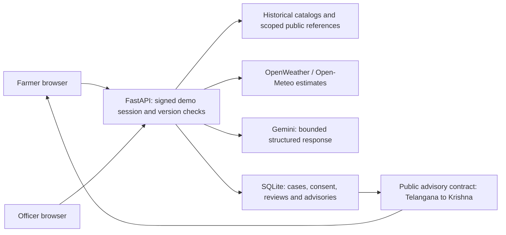

# AgriSaathi

**A companion for clearer crop questions and human agricultural support.**

AgriSaathi is a working demonstration for Rice and Maize in Nalgonda and Khammam
(Telangana), and Krishna (Andhra Pradesh). Farmers can ask in English, Telugu or
Hindi, inspect the basis and limits of an answer, and consent to officer follow-up.
Officers review private requests and separately publish expiring public advisories.
Telangana advisories are automatically shared with matching Krishna crop profiles
inside the same backend.

**Judges:** follow the setup below, then [the short judge journey](docs/demo-script.md).
For a public URL, follow [DEPLOYMENT_GUIDE.md](DEPLOYMENT_GUIDE.md).

## What is built, and what is limited

- Gemini receives scoped evidence as prompt context, with bounded structured output,
  citation-ID validation, deadlines, fallback attempts and visible failure categories.
  This does not train a model or establish agronomic correctness.
- Evidence separates current town weather or labelled weather-model estimates,
  historical NASA climate, modelled SoilGrids soil and historical crop presence.
- Crop-cycle lookup shows recorded Rice/Maize seasons and other historical entries;
  it does not optimize rotations or prove current field suitability.
- Officer requests require separate contact/photo consent. Case review and farmer
  replies check versions to prevent stale updates. Closed cases are read only.
- Public sharing excludes structured private contact/photo fields. Pattern checks
  block detected identifiers in advisory text; human privacy review is still needed.
- Voice input and response reading depend on browser services. Typing remains
  available. There is no server speech service.

This is **one FastAPI backend with SQLite and public demo identities**, not a
government integration or production farmer service. Archived satellite references
remain in backend evidence; the farmer satellite card is hidden. There is no live
satellite monitoring, GPS detection, plot soil test, fertilizer schedule or claimed
field accuracy. Read [the data card](docs/data-card.md) and
[evaluation limits](docs/evaluation.md).

## Prerequisites

Install these once:

| Tool | Version | Purpose |
|---|---|---|
| [Git](https://git-scm.com/downloads) | Current supported release | Clone this repository |
| [Python](https://www.python.org/downloads/) | 3.13 recommended | Run the backend and tests |
| [Node.js](https://nodejs.org/en/download) | 22 LTS | Run/build the frontend; includes npm |

On Windows, enable **Add Python to PATH** during installation. Open a new
PowerShell window after installing. Verify:

```powershell
git --version
python --version
node --version
npm --version
```

Docker is optional. You do not need the original workspace, the large research
CSV, an existing database, or a cloud account to start locally. Prepared public
reference data is included. No dependencies, keys, uploads or case history are
committed.

## Step-by-step setup guide

### 1. Clone and open the repository

In PowerShell, choose where to keep the project, then run:

```powershell
git clone https://github.com/gayazali-16/AgriSaathi.git
cd AgriSaathi
```

This folder contains `README.md`, `.env.example`, `backend/` and `frontend/`.
All commands below start from this repository root unless stated otherwise.

### 2. Create your private `.env` file

For a **new clone**, run:

```powershell
Copy-Item .env.example .env
notepad .env
```

Do not overwrite an existing `.env` on a later run. In Notepad:

| Setting | What to do |
|---|---|
| `APP_ENV=development` | Keep for local development |
| `DEMO_MODE=true` | Keep to enable the sample accounts |
| `GEMINI_API_KEY=` | Paste your own Gemini key after `=` for live AI; otherwise leave empty |
| `GEMINI_MODEL=gemini-3.5-flash-lite` | Default model; change only to an API model available to your account |
| `OPENWEATHER_API_KEY=` | Optional; leave empty for labelled Open-Meteo weather estimates |
| `ENABLE_NO_KEY_WEATHER=true` | Keep for those estimates; set false to disable their network calls |
| `SESSION_SECRET=` | Generate it in Step 4 |
| Other settings | Keep their defaults |

Save the file and close Notepad. Obtain a key privately from
[Google AI Studio](https://aistudio.google.com/app/apikey). Never upload `.env`,
paste keys into chat, or include them in screenshots. The app can start without
a Gemini key: it saves **AI guidance unavailable** and offers officer contact.
That is an honest abstention, not a generated AI answer.

### 3. Install the backend in its own Python environment

From the repository root:

```powershell
python -m venv .venv
.\.venv\Scripts\python.exe -m pip install -r requirements.txt
```

Wait for installation to finish without errors. These commands use the environment
directly, so you do not need to change PowerShell's script execution policy.

### 4. Generate a session secret once

Run this **once after creating `.env`**. It writes a random secret into your private
file without displaying it:

```powershell
.\.venv\Scripts\python.exe -c "from pathlib import Path; import re,secrets; p=Path('.env'); p.write_text(re.sub(r'(?m)^SESSION_SECRET=.*$', 'SESSION_SECRET='+secrets.token_urlsafe(48), p.read_text(encoding='utf-8')), encoding='utf-8')"
```

Keep the same value across restarts. Regenerating it signs out existing sessions.

### 5. Start the backend — Terminal 1

From the repository root:

```powershell
.\.venv\Scripts\python.exe -m uvicorn backend.main:app --reload --host 127.0.0.1 --port 8001
```

Leave this terminal open. Check
**[http://localhost:8001/api/v1/health](http://localhost:8001/api/v1/health)**.
Expect `status: ok` and `demo_mode: true`. `live_gemini_configured` only means
a key is configured; a successful new response verifies a working provider call.

### 6. Install and start the frontend — Terminal 2

Open a **second PowerShell terminal** in the repository root:

```powershell
cd frontend
npm ci
$env:API_PROXY_TARGET = 'http://127.0.0.1:8001'
npm run dev
```

Leave this terminal open too. `npm ci` uses the committed lockfile; it is needed
on first setup or after the dependencies change, not every time you start.

### 7. Open the application

Open **[http://localhost:5174](http://localhost:5174)**. The login page appears first.
Select **English**, **Telugu** or **Hindi** in the language dropdown.

All accounts below use the public password **`123`**:

| Username | Role | Scope |
|---|---|---|
| `ramesh` | Farmer | Nalgonda Rice |
| `suresh` | Farmer | Second Nalgonda Rice profile |
| `anil` | Farmer | Khammam Maize |
| `lakshmi` | Farmer | Krishna Rice and Maize |
| `rajesh` | Officer | Telangana |
| `priya` | Officer | Andhra Pradesh |

Use **Sign out** before switching roles. Normal browser tabs share a session cookie;
use separate profiles if you need both roles at once. A new clone starts with
sample field profiles and **empty case/advisory history**. It does not replay a
developer's saved AI answer. Use only synthetic contact details/photos.

Try: `How can I keep a simple weekly record of irrigation and rainfall for my rice field?`
Then follow [the judge journey](docs/demo-script.md) to request help, review the
case, publish an advisory and check Lakshmi's matching feed.

### 8. Stop and run again

Press **Ctrl+C in each terminal** to stop. Next time, repeat **Steps 5 and 6**,
omitting `npm ci`. Keep `.env` and `.venv`; dependency installation is not a daily task.
Local SQLite history and private uploads are created under `backend/data/runtime/`
and `backend/data/uploads/`, both ignored by Git.

### macOS / Linux command equivalents

Use `cp .env.example .env` and your editor in Step 2. Python may be named `python3`:

```bash
python3 -m venv .venv
.venv/bin/python -m pip install -r requirements.txt
.venv/bin/python -c "from pathlib import Path; import re,secrets; p=Path('.env'); p.write_text(re.sub(r'(?m)^SESSION_SECRET=.*$', 'SESSION_SECRET='+secrets.token_urlsafe(48), p.read_text(encoding='utf-8')), encoding='utf-8')"
.venv/bin/python -m uvicorn backend.main:app --reload --host 127.0.0.1 --port 8001
```

In a separate terminal at the repository root:

```bash
cd frontend
npm ci
API_PROXY_TARGET=http://127.0.0.1:8001 npm run dev
```

## Troubleshooting

| Symptom | What to check |
|---|---|
| `python`, `node`, `npm` or `git` not found | Install prerequisites and open a new terminal |
| Port 8001 or 5174 already in use | Stop the existing app's terminal or use its running instance; Vite does not silently select another port |
| Login or API requests fail | Confirm Terminal 1 is running and its health URL works; restart Vite after changing `API_PROXY_TARGET` |
| AI unavailable | Read the displayed category; check your private key, account/model access and quota. Restart the backend after editing `.env` |
| Weather is absent | Check provider/network availability and the no-key setting; historical climate is not today's fallback |
| Empty officer queue | Submit the separate farmer contact form with consent, then Refresh officer queue |
| Cannot publish | Approve the selected case first; publication is a separate action |
| Another person's changes conflict | Refresh the case; the app intentionally rejects stale versions |
| Microphone unavailable | Use Type instead; browser support and permissions vary |

## Tests and production build

From the root, with dependencies installed:

```powershell
.\.venv\Scripts\python.exe -m pytest backend/tests --basetemp .test-tmp
.\.venv\Scripts\python.exe -m scripts.validate_public_data
.\.venv\Scripts\python.exe -m scripts.check_docs
cd frontend
npm test
npm run build
```

For both Playwright browser journeys (including accessibility checks), **stop the
development servers first**, then from `frontend/`:

```powershell
npx playwright install chromium
$env:PYTHON_COMMAND = (Resolve-Path ..\.venv\Scripts\python.exe).Path
npm run test:e2e
```

Playwright starts its own backend/frontend and uses a separate test database.
On Linux set `PYTHON_COMMAND` to the absolute `.venv/bin/python` path. Tests mock
AI/provider behavior and do not establish live agronomic accuracy. See
[MANUAL_TESTING_GUIDE.md](MANUAL_TESTING_GUIDE.md) for human verification.

The clean-checkout checks and their limits are recorded in
[submission verification](docs/verification.md).

## Architecture



The [detailed runtime diagram](docs/runtime-architecture.html) is a self-contained
HTML document; download and open it locally. Its specification and hash receipt
are included. Logical components in the diagram are not separate servers.

## Data, attribution and repository layout

The combined dataset's documentation names seven public source families; the
team took part in building that combined historical dataset. This app uses a
small prepared slice, not the entire CSV or a training pipeline. Source lineage
and numeric-unit limitations remain explicit.

- [Data card](docs/data-card.md), [public data access](docs/data-access.md),
  [source README](docs/sources/crop-dataset-README.md) and
  [source references](docs/sources/crop-dataset-references.pdf).
- [Third-party notices](THIRD_PARTY_NOTICES.md) and the original
  [dataset MIT license](DATASET-LICENSE). Dataset and diagram licenses do not
  grant an application-wide license to original AgriSaathi source code.
- [Evaluation](docs/evaluation.md): small self-authored text scenarios and
  preserved initial/retry results; no expert accuracy percentage.

```text
backend/          FastAPI code, prepared references, tests and evaluation scenarios
frontend/         React source, dependency lockfile and browser tests
scripts/          Data preparation/validation, evaluation and demo maintenance
docs/             Judge journey, provenance, evaluation, diagram and deployment
.env.example      Empty configuration template; copy privately to .env
Dockerfile        Builds the frontend and serves SPA + API from one container
DEPLOYMENT_GUIDE.md  Plain-language Cloud Run demonstration deployment
```

Large original datasets, environments, dependency folders, caches, generated
frontend builds, private runtime state, recordings and development work logs are
excluded from the submission. The bundled small reference files retain the
provenance needed to run and inspect the app.
